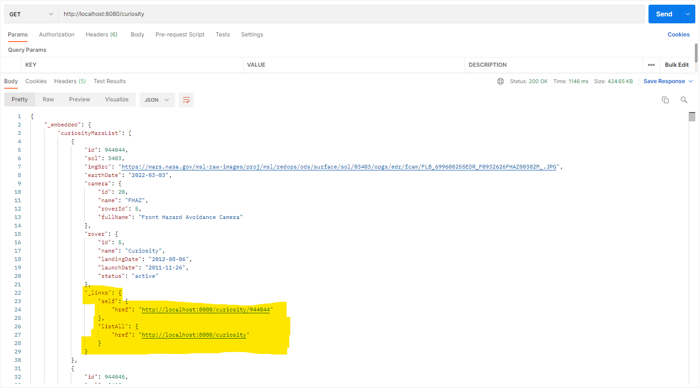
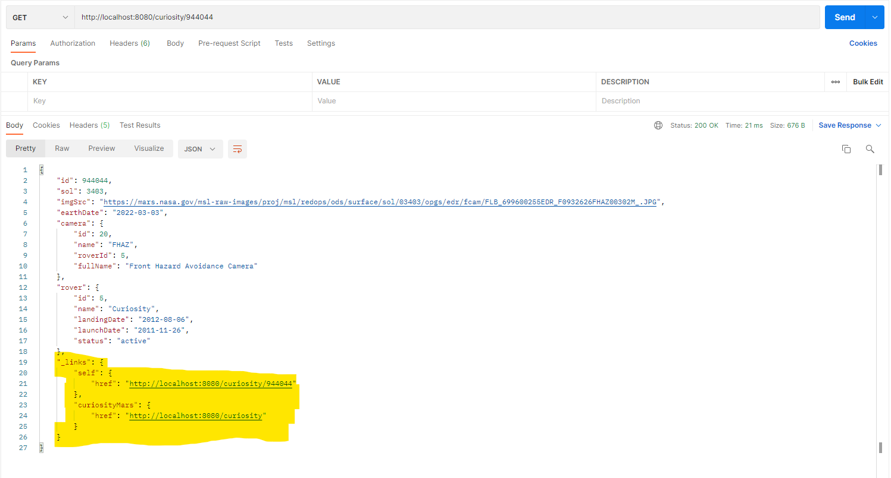

[![Contributors][contributors-shield]][contributors-url]
[![Forks][forks-shield]][forks-url]
[![Stargazers][stars-shield]][stars-url]
[![Issues][issues-shield]][issues-url]
[![LinkedIn][linkedin-shield]][linkedin-url]

<h3 align="center">Java Spring Boot Restservice Hateoas</h3>
 

    

 

    

        Project focused on exemplifying real cases of using the functional programming paradigm with Java Streams.
    

    

        As I advance in my studies, I will feed the project, always looking for clearer, reusable and performative solutions.
    

    

        I hope this project is as useful to you as many others were to me.
    

 

  
Built with :nerd_face:

  <ol>
    <li>Java</li>
    <li>String Boot</li>
    <li>Spring JPA</li>
    <li>Spring Hateoas</li>
    <li>Lombok</li>
    <li>Google Guava</li>
    <li>Gson</li>
    <li>H2 Database</li>
  </ol>

 

  
How it looks like :star_struck:

  <ol>
    <li>
      

        
      

    </li>
    <li>
    

        
    
    
    </li>
  </ol>

 

<!-- MARKDOWN LINKS & IMAGES -->
[contributors-shield]: https://img.shields.io/github/contributors/Mayllon/java-spring-boot-restservice-hateoas.svg?style=for-the-badge
[contributors-url]: https://github.com/Mayllon/java-spring-boot-restservice-hateoas/graphs/contributors
[forks-shield]: https://img.shields.io/github/forks/Mayllon/java-spring-boot-restservice-hateoas.svg?style=for-the-badge
[forks-url]: https://github.com/Mayllon/java-spring-boot-restservice-hateoas/network/members
[stars-shield]: https://img.shields.io/github/stars/Mayllon/java-spring-boot-restservice-hateoas.svg?style=for-the-badge
[stars-url]: https://github.com/oMayllon/java-spring-boot-restservice-hateoas/stargazers
[issues-shield]: https://img.shields.io/github/issues/Mayllon/java-spring-boot-restservice-hateoas.svg?style=for-the-badge
[issues-url]: https://github.com/Mayllon/java-spring-boot-restservice-hateoas/issues
[linkedin-shield]: https://img.shields.io/badge/-LinkedIn-black.svg?style=for-the-badge&logo=linkedin&colorB=555
[linkedin-url]: https://pt.linkedin.com/in/mayllonbaumer
